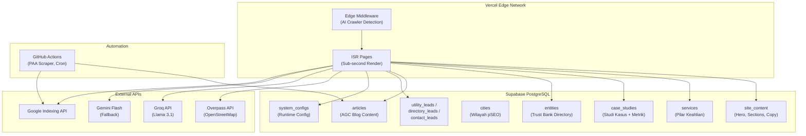

# Rombak Total: ZADIT Growth Portfolio V2 — Trust Bank System

## Ringkasan Tujuan

Membangun ulang seluruh ekosistem web **muhzadit.vercel.app** dari nol menjadi platform **production-ready** dengan prinsip:
- **Zero Hardcode**: Semua konten, copy, konfigurasi bersumber dari Supabase PostgreSQL
- **Admin-Updatable**: Seluruh teks, layanan, studi kasus, artikel bisa di-update via Admin Dashboard
- **Backend-First**: Database adalah Source of Truth — frontend hanya merender data dari DB
- **Performance**: LCP <2.5s, CLS=0, INP <200ms, Lighthouse 90+ semua kategori
- **SEO/AEO/GEO Ready**: Entity graph, dynamic sitemap, llms.txt, JSON-LD schema

> [!IMPORTANT]
> Proyek ini menggunakan **Vercel Hobby Tier** dan **Supabase Free Tier**. Semua arsitektur harus mematuhi limitasi ini (tidak ada long-running background processes di Vercel, cron via GitHub Actions).

---

## Open Questions

> [!IMPORTANT]
> **Q1: Supabase MCP Authentication**
> Saat ini koneksi Supabase MCP gagal (unauthorized). Apakah Anda sudah mengautentikasi Supabase MCP di Antigravity Settings? Kita memerlukan ini agar bisa membuat tabel langsung. Alternatifnya: saya buat SQL script dan Anda jalankan manual di Supabase Dashboard.

> [!IMPORTANT]
> **Q2: Domain**
> Dokumen `.context` merujuk `zadit.dev` sebagai domain. Deployment saat ini di `muhzadit.vercel.app`. Apakah domain `zadit.dev` sudah dibeli atau apakah kita tetap pakai `muhzadit.vercel.app`? Ini memengaruhi semua JSON-LD schema, sitemap, dan SEO config.

> [!IMPORTANT]
> **Q3: Foto Profil**
> Untuk EEAT dan OG Image, dibutuhkan foto asli Zadit (JPG/WebP). Apakah sudah tersedia atau perlu disiapkan?

> [!IMPORTANT]
> **Q4: Environment Variables**
> Apakah semua API key berikut sudah tersedia di `.env.local` dan Vercel Dashboard?
> - `GROQ_API_KEY` — untuk AGC content generation (primary LLM)
> - `GOOGLE_CLIENT_EMAIL` + `GOOGLE_PRIVATE_KEY` — untuk Google Indexing API
> - `ADMIN_SECRET_KEY` — untuk admin auth gate

> [!IMPORTANT]
> **Q5: WhatsApp Number**
> Nomor WhatsApp Zadit yang akan digunakan untuk CTA pre-filled? (format: 62xxx)

---

## Arsitektur Sistem



---

## Database Schema (8 Tabel + 3 Leads)

### Tabel Baru yang Akan Dibuat

| Tabel | Fungsi | Admin Editable |
|-------|--------|:-:|
| `site_content` | Semua teks landing page (hero, process steps, partnership copy) | ✅ |
| `services` | 5-6 pilar keahlian Zadit (Bento Grid) | ✅ |
| `case_studies` | Studi kasus + metrik + testimonial | ✅ |
| `cities` | Kota target untuk pSEO directory | ✅ |
| `entities` | Profil entitas Trust Bank Directory | ✅ |
| `articles` | Konten blog AGC | ✅ |
| `system_configs` | Konfigurasi runtime (prompt AI, WhatsApp, dll) | ✅ |
| `paa_questions` | Bank pertanyaan PAA untuk FAQ | ✅ |
| `utility_leads` | Leads dari audit engine | 🔍 View |
| `directory_leads` | Leads dari klaim profil direktori | 🔍 View |
| `contact_leads` | Leads dari form partnership | 🔍 View |

### SQL Schema (akan dijalankan via migrasi)

```sql
-- 1. site_content: Semua teks/copy halaman yang bisa di-update admin
CREATE TABLE site_content (
  id UUID DEFAULT gen_random_uuid() PRIMARY KEY,
  section_key TEXT UNIQUE NOT NULL,     -- 'hero_headline', 'hero_subheading', 'process_title', dll
  content_type TEXT NOT NULL DEFAULT 'text',  -- 'text', 'html', 'json'
  value TEXT NOT NULL,
  metadata JSONB,                        -- data tambahan (icon, warna, urutan)
  updated_at TIMESTAMPTZ DEFAULT now()
);

-- 2. services: Pilar keahlian untuk Bento Grid
CREATE TABLE services (
  id UUID DEFAULT gen_random_uuid() PRIMARY KEY,
  title TEXT NOT NULL,
  subtitle TEXT,
  description TEXT NOT NULL,
  icon_name TEXT NOT NULL,               -- nama ikon Lucide: 'Globe', 'Presentation', dll
  tags TEXT[],                           -- ['Core Web Vitals', 'Next.js', 'ISR']
  display_order INT NOT NULL DEFAULT 0,
  size TEXT DEFAULT 'large',             -- 'large', 'small' (untuk Bento layout)
  is_active BOOLEAN DEFAULT true,
  created_at TIMESTAMPTZ DEFAULT now()
);

-- 3. case_studies: Studi kasus dengan metrik
CREATE TABLE case_studies (
  id UUID DEFAULT gen_random_uuid() PRIMARY KEY,
  sector_badge TEXT NOT NULL,            -- 'Sektor Publik & Kemitraan Pemerintah'
  client_name TEXT NOT NULL,             -- deskriptif, bukan nama asli
  challenge TEXT NOT NULL,
  approach TEXT NOT NULL,
  metrics JSONB NOT NULL,                -- [{"label": "Keterbacaan Google", "value": "+148%", "number": 148}]
  testimonial_text TEXT,
  testimonial_author TEXT,
  testimonial_role TEXT,
  tech_tags TEXT[],                      -- ['SEO Teknikal', 'Entity Graph', 'ISR']
  display_order INT NOT NULL DEFAULT 0,
  is_active BOOLEAN DEFAULT true,
  created_at TIMESTAMPTZ DEFAULT now()
);

-- 4. cities: Entitas wilayah target pSEO
CREATE TABLE cities (
  id UUID DEFAULT gen_random_uuid() PRIMARY KEY,
  name TEXT NOT NULL,
  slug TEXT UNIQUE NOT NULL,
  latitude DOUBLE PRECISION NOT NULL,
  longitude DOUBLE PRECISION NOT NULL,
  target_niche TEXT,
  created_at TIMESTAMPTZ DEFAULT now()
);
CREATE INDEX idx_cities_slug ON cities(slug);

-- 5. entities: Trust Bank Directory
CREATE TABLE entities (
  id UUID DEFAULT gen_random_uuid() PRIMARY KEY,
  city_id UUID REFERENCES cities(id) ON DELETE SET NULL,
  entity_type TEXT NOT NULL CHECK (entity_type IN ('individual','institution','agency','brand','product','service')),
  name TEXT NOT NULL,
  slug TEXT UNIQUE NOT NULL,
  tagline TEXT,
  description TEXT,
  contact_phone TEXT,
  contact_email TEXT,
  website_url TEXT,
  logo_url TEXT,
  verification_status TEXT DEFAULT 'unverified' CHECK (verification_status IN ('unverified','claimed','verified')),
  trust_score REAL DEFAULT 0.0,
  affiliate_url TEXT,
  claim_token TEXT,
  raw_metadata JSONB,
  created_at TIMESTAMPTZ DEFAULT now()
);
CREATE INDEX idx_entities_slug ON entities(slug);
CREATE INDEX idx_entities_city ON entities(city_id, verification_status);

-- 6. articles: Blog AGC
CREATE TABLE articles (
  id UUID DEFAULT gen_random_uuid() PRIMARY KEY,
  title TEXT NOT NULL,
  slug TEXT UNIQUE NOT NULL,
  source_feed TEXT,
  original_url TEXT,
  content TEXT NOT NULL,                 -- konten artikel (HTML/Markdown)
  meta_title TEXT,
  meta_description TEXT,
  semantic_keywords TEXT[],
  faq_items JSONB,                       -- [{question, answer}]
  is_published BOOLEAN DEFAULT false,
  published_at TIMESTAMPTZ DEFAULT now(),
  updated_at TIMESTAMPTZ DEFAULT now()
);
CREATE INDEX idx_articles_slug ON articles(slug);

-- 7. system_configs: Konfigurasi dinamis
CREATE TABLE system_configs (
  key TEXT PRIMARY KEY,
  value JSONB NOT NULL,
  description TEXT,
  updated_at TIMESTAMPTZ DEFAULT now()
);

-- 8. paa_questions: Bank pertanyaan PAA
CREATE TABLE paa_questions (
  id UUID DEFAULT gen_random_uuid() PRIMARY KEY,
  keyword TEXT NOT NULL,
  question TEXT NOT NULL,
  answer TEXT NOT NULL,
  article_id UUID REFERENCES articles(id) ON DELETE SET NULL,
  created_at TIMESTAMPTZ DEFAULT now()
);

-- 9. utility_leads: Leads dari audit engine
CREATE TABLE utility_leads (
  id UUID DEFAULT gen_random_uuid() PRIMARY KEY,
  lead_name TEXT NOT NULL,
  contact_info TEXT NOT NULL,
  target_site_url TEXT,
  audit_category TEXT NOT NULL,
  accessibility_score INT,
  narrative_score INT,
  status TEXT DEFAULT 'new' CHECK (status IN ('new','contacted','won')),
  created_at TIMESTAMPTZ DEFAULT now()
);

-- 10. directory_leads: Leads dari klaim profil
CREATE TABLE directory_leads (
  id UUID DEFAULT gen_random_uuid() PRIMARY KEY,
  entity_id UUID REFERENCES entities(id) ON DELETE SET NULL,
  full_name TEXT NOT NULL,
  position TEXT,
  email TEXT NOT NULL,
  whatsapp TEXT NOT NULL,
  created_at TIMESTAMPTZ DEFAULT now()
);

-- 11. contact_leads: Leads dari form partnership
CREATE TABLE contact_leads (
  id UUID DEFAULT gen_random_uuid() PRIMARY KEY,
  visitor_type TEXT,                     -- 'umkm', 'hrd', 'investor', 'government'
  needs TEXT[],                          -- ['website', 'seo', 'slides', 'analytics']
  project_description TEXT,
  full_name TEXT NOT NULL,
  whatsapp TEXT NOT NULL,
  email TEXT,
  created_at TIMESTAMPTZ DEFAULT now()
);

-- Row Level Security: Allow public inserts, admin-only reads
ALTER TABLE utility_leads ENABLE ROW LEVEL SECURITY;
ALTER TABLE directory_leads ENABLE ROW LEVEL SECURITY;
ALTER TABLE contact_leads ENABLE ROW LEVEL SECURITY;

CREATE POLICY "Public insert utility_leads" ON utility_leads FOR INSERT TO anon WITH CHECK (true);
CREATE POLICY "Public insert directory_leads" ON directory_leads FOR INSERT TO anon WITH CHECK (true);
CREATE POLICY "Public insert contact_leads" ON contact_leads FOR INSERT TO anon WITH CHECK (true);

-- Public read for content tables
ALTER TABLE site_content ENABLE ROW LEVEL SECURITY;
ALTER TABLE services ENABLE ROW LEVEL SECURITY;
ALTER TABLE case_studies ENABLE ROW LEVEL SECURITY;
ALTER TABLE cities ENABLE ROW LEVEL SECURITY;
ALTER TABLE entities ENABLE ROW LEVEL SECURITY;
ALTER TABLE articles ENABLE ROW LEVEL SECURITY;
ALTER TABLE system_configs ENABLE ROW LEVEL SECURITY;

CREATE POLICY "Public read site_content" ON site_content FOR SELECT TO anon USING (true);
CREATE POLICY "Public read services" ON services FOR SELECT TO anon USING (true);
CREATE POLICY "Public read case_studies" ON case_studies FOR SELECT TO anon USING (true);
CREATE POLICY "Public read cities" ON cities FOR SELECT TO anon USING (true);
CREATE POLICY "Public read entities" ON entities FOR SELECT TO anon USING (true);
CREATE POLICY "Public read articles" ON articles FOR SELECT TO anon USING (true);
CREATE POLICY "Public read system_configs" ON system_configs FOR SELECT TO anon USING (true);
CREATE POLICY "Public read paa_questions" ON paa_questions FOR SELECT TO anon USING (true);
```

---

## Proposed Changes

### Phase 1: Database Foundation & Design System (Hari 1)

Meletakkan fondasi database dan design system sebelum membangun komponen apapun.

---

#### [MODIFY] [globals.css](file:///Users/mac/Downloads/ZADITPROFILE/src/app/globals.css)
- Update design tokens sesuai ZADIT_FRONTEND_UIUX_MASTER.md
- Tambah `--font-display` untuk Plus Jakarta Sans (heading utama)
- Tambah utilities: `perspective-1000`, `transform-style-3d`, scroll-driven animations
- Tambah gauge meter CSS untuk audit engine
- Tambah `@starting-style` untuk dialog/overlay animasi

#### [MODIFY] [layout.tsx](file:///Users/mac/Downloads/ZADITPROFILE/src/app/layout.tsx)
- Font loading: Plus Jakarta Sans (800,700,600), Inter (400,500), JetBrains Mono (400)
- JSON-LD `ProfilePage` schema lengkap (Person entity with `knowsAbout`, `sameAs`, `worksFor`)
- Meta tags lengkap (OG, Twitter Card, robots max-image-preview:large)
- SmoothScroll wrapper via Lenis

#### [NEW] `src/lib/supabase-server.ts`
- Server-side Supabase client menggunakan `SUPABASE_SERVICE_ROLE_KEY` (untuk admin ops)
- Separated from client-side `supabase.ts`

#### [MODIFY] [supabase.ts](file:///Users/mac/Downloads/ZADITPROFILE/src/lib/supabase.ts)
- Hapus placeholder fallback, gunakan env vars langsung
- Tambah TypeScript types untuk semua tabel

#### [NEW] `src/lib/types.ts`
- Interface untuk semua database entities: `SiteContent`, `Service`, `CaseStudy`, `City`, `Entity`, `Article`, `SystemConfig`, `PAA`, `Lead`, dll
- Type-safe query helpers

#### [NEW] `src/lib/data.ts`
- Centralized data fetching layer
- Fungsi: `getSiteContent()`, `getServices()`, `getCaseStudies()`, `getCities()`, `getEntities()`, `getArticles()`, `getConfig()`
- Semua fungsi fetch dari Supabase, **bukan hardcode**
- ISR caching strategy via `unstable_cache` / `revalidate`

#### **Database Migration**
- Jalankan SQL schema di atas via Supabase Dashboard
- Seed data awal untuk `site_content`, `services`, `case_studies`

---

### Phase 2: Landing Page — Scrollytelling (Hari 2-3)

Seluruh data di-fetch dari database. Tidak ada teks hardcode.

---

#### [MODIFY] [page.tsx](file:///Users/mac/Downloads/ZADITPROFILE/src/app/page.tsx)
- Server Component: fetch `site_content`, `services`, `case_studies` dari Supabase
- Pass data sebagai props ke komponen child
- `export const revalidate = 3600` (ISR 1 jam)

#### [MODIFY] [Header.tsx](file:///Users/mac/Downloads/ZADITPROFILE/src/components/Header.tsx)
- Rombak total ke Warm Corporate Editorial
- CSS Scroll-Driven Animation untuk header shrink
- Logo monogram "Z" (SVG inline)
- Identity text: `font-mono text-[10px] tracking-widest text-teal-400`
- Nav links: jump links smooth scroll via Lenis
- CTA: "Konsultasi" → scroll to `#contact`
- System Status: pulsing green dot `● AKTIF`

#### [MODIFY] [HeroSection.tsx](file:///Users/mac/Downloads/ZADITPROFILE/src/components/HeroSection.tsx)
- Receive `content` props dari page.tsx (bukan hardcode)
- Layout asimetris 60/40 (teks + System Status Panel)
- H1 headline dari DB: "Dari Kata ke Konversi. Dari Data ke Dominasi."
- GSAP stagger per-kata untuk text reveal
- System Status Panel: LCP, A11y, AEO status (dari `system_configs`)
- Stat bar: "10+ Tahun · 50+ Proyek · 3 Klien Institusional" (dari DB, animated counter)
- CTA Primary + Secondary
- Floating "● Tersedia untuk Proyek" badge

#### [MODIFY] [ProcessSection.tsx](file:///Users/mac/Downloads/ZADITPROFILE/src/components/ProcessSection.tsx)
- Receive `steps` props (array dari `site_content` table)
- GSAP ScrollTrigger horizontal pin: 6 kartu × 100vw
- Kartu dengan nomor besar di background (opacity 3%)
- Dot progress indicator
- Ikon Lucide per step
- `prefers-reduced-motion` fallback

#### [MODIFY] [CaseStudiesSection.tsx](file:///Users/mac/Downloads/ZADITPROFILE/src/components/CaseStudiesSection.tsx)
- Receive `caseStudies` props dari `case_studies` table
- Scroll-snap vertikal stacking cards
- GSAP animated number counters (trigger saat 50% viewport)
- Sector badge, metrik, testimonial, tech tags — semua dari DB
- TiltCard 3D CSS effect

#### [MODIFY] [ServicesGrid.tsx](file:///Users/mac/Downloads/ZADITPROFILE/src/components/ServicesGrid.tsx)
- Receive `services` props dari `services` table
- Bento Grid layout (3 besar + 2 kecil) — ukuran ditentukan oleh field `size`
- Ikon Lucide dinamis berdasarkan `icon_name` dari DB
- TiltCard hover effect
- Tags dari DB

#### [MODIFY] [PartnershipForm.tsx](file:///Users/mac/Downloads/ZADITPROFILE/src/components/PartnershipForm.tsx)
- 4-step wizard form (Foot-in-the-Door technique)
- Step 1: Visitor type (radio)
- Step 2: Needs (checkbox multi-select)
- Step 3: Project description (textarea)
- Step 4: Contact info (nama, WhatsApp, email)
- Submit → `contact_leads` table di Supabase (Server Action)
- View Transition API antar step

#### [MODIFY] [SidebarNav.tsx](file:///Users/mac/Downloads/ZADITPROFILE/src/components/SidebarNav.tsx)
- Sticky right dots + label on hover
- IntersectionObserver untuk deteksi section aktif
- Teal pulsing ring pada dot aktif

#### [MODIFY] [Footer.tsx](file:///Users/mac/Downloads/ZADITPROFILE/src/components/Footer.tsx)
- Konten dari `site_content` table (copyright text, social links)
- Clean editorial styling

---

### Phase 3: Feature Pages (Hari 4-6)

---

#### [MODIFY] `/directory/[city]/page.tsx`
- Server Component: fetch `entities` WHERE `city_id` = selected city
- Smart search (client-side filtering via `useDeferredValue`)
- Category filter tabs: Semua, Institusi, Agensi, Brand, UMKM, Layanan
- Entity Card Grid (nama, badge kategori, trust score, status verifikasi)
- Card click → overlay slide panel (View Transitions API)
- Overlay: detail profil + CTA "Klaim Profil" + slot afiliasi
- Form klaim → `directory_leads` table
- JSON-LD `LocalBusiness` + co-citation entity graph
- Breadcrumb JSON-LD
- `export const revalidate = 3600`

#### [NEW] `/directory/page.tsx`
- Index halaman: daftar semua kota dari `cities` table
- Link ke setiap `/directory/[city]`

#### [MODIFY] `/blog/[slug]/page.tsx`
- Server Component: fetch article by slug dari `articles` table
- Definition-Lead structure (200 kata pertama)
- Max-width 680px untuk reading comfort
- Reading progress bar (CSS Scroll-Driven Animation)
- QABlock FAQ (dari `faq_items` JSONB) + FAQPage JSON-LD
- Sticky sidebar CTA: "Butuh Implementasi Sistem Serupa?"
- Author bio + EEAT signals
- Internal links ke directory & utility
- Article schema JSON-LD + BreadcrumbList

#### [NEW] `/blog/page.tsx`
- Blog index: daftar semua artikel published
- Card grid dengan thumbnail, title, date, read time
- Pagination

#### [MODIFY] `/utility/audit-engine/page.tsx`
- Form input: Nama, WhatsApp, URL
- Submit → `utility_leads` table (Server Action)
- Client-side simulated audit (deterministic hash-based scoring)
- SVG gauge meter animasi
- Rekomendasi spesifik berdasarkan skor
- CTA → WhatsApp pre-filled template

---

### Phase 4: Admin Command Center (Hari 7-9)

---

#### [MODIFY] `/admin/dashboard/page.tsx`
- Rombak total menjadi 4-tab Command Center
- Auth gate: `ADMIN_SECRET_KEY` dari cookie
- Dynamic Status Cards (counts dari DB: entities, leads, articles)

#### [NEW] `src/components/admin/DataRegistryTab.tsx`
- CRUD entitas & kota (searchable, sortable DataTable)
- [+ Tambah Entitas] dialog form
- [Import CSV] + [Export JSON] buttons
- [Trigger Scrape OSM] → call Overpass API
- CRUD untuk `site_content`, `services`, `case_studies`

#### [NEW] `src/components/admin/AIControlTab.tsx`
- Textarea: edit global system prompt (dari `system_configs.ai_prompt`)
- Dropdown model selector: Groq Llama / Gemini Flash
- [Trigger RSS Fetch & Rewrite] button
- List artikel terbaru dengan status rewrite

#### [NEW] `src/components/admin/SEOOpsTab.tsx`
- Input URL → trigger Google Indexing API
- Bulk submit via IndexNow
- Monitoring log: terakhir diindeks, status
- Preview sitemap.xml

#### [NEW] `src/components/admin/ConfigTab.tsx`
- Inline-editable key-value table dari `system_configs`
- Save confirmation toast
- Keys: `site_title`, `whatsapp_number`, `hero_headline`, `ai_prompt`, `available_status`, dll

#### [NEW] `src/components/admin/LeadsTab.tsx`
- View semua leads (utility, directory, contact) dalam unified table
- Filter by type, status, date
- Export CSV
- Update status (new → contacted → won)

---

### Phase 5: SEO/AEO/GEO & Automation (Hari 10-11)

---

#### [MODIFY] `/sitemap.xml/route.ts`
- Dynamic sitemap dari Supabase (cities, entities, articles)
- Priority: 1.0 (landing), 0.9 (directory), 0.8 (blog)

#### [NEW] `src/middleware.ts`
- AI Crawler Detection (GPTBot, ClaudeBot, PerplexityBot, dll)
- Route ke `/llms.txt` untuk bot AI
- Human intent tracking (referral query parameter reading)

#### [NEW] `public/llms.txt`
- Ringkasan profil Zadit dalam format Markdown untuk AI crawlers
- Core identity, expertise, notable work, education, availability

#### [NEW] `public/llms-full.txt`
- Versi lengkap dengan case studies, services, methodology

#### [NEW] `src/app/api/index-now/route.ts`
- POST endpoint: ping Google Indexing API + IndexNow
- Auth: admin secret header

#### [NEW] `src/app/api/agc/route.ts`
- POST endpoint: trigger RSS fetch + LLM rewrite
- Multi-LLM routing (Groq → Gemini fallback)
- Save ke `articles` table

#### [NEW] `src/app/api/osm-scrape/route.ts`
- POST endpoint: query Overpass API by city coordinates
- Transform → upsert ke `entities` table

#### [NEW] `src/app/robots.txt/route.ts`
- Dynamic robots.txt (edge-injected)
- Allow all, sitemap reference

#### [NEW] `.github/workflows/paa-scraper.yml`
- Weekly cron (Monday 3AM UTC)
- Scrape PAA questions → save to Supabase
- Trigger Vercel revalidation

---

### Phase 6: Performance Optimization & Production Launch (Hari 12-14)

---

#### Performance Optimizations
- Lazy import GSAP (`dynamic import`) hanya pada komponen yang membutuhkan
- `next/image` dengan priority untuk hero images
- Font subsetting dan `display: swap`
- `content-visibility: auto` pada section di bawah fold
- Verifikasi Core Web Vitals (LCP <2.5s, CLS=0, INP <200ms)

#### SEO Verification
- Validasi JSON-LD via Google Rich Results Test
- Submit sitemap.xml ke Google Search Console
- Submit ke Bing Webmaster Tools
- Test `llms.txt` accessibility

#### Accessibility (A11y)
- WCAG 2.1 AA compliance seluruh halaman
- Semua animasi punya `prefers-reduced-motion` fallback
- Semantic HTML: `<header>`, `<nav>`, `<main>`, `<section>`, `<article>`, `<footer>`
- Aria labels pada semua interactive elements
- Skip-to-content link

#### Deploy & Go Live
- Vercel production deploy via CLI
- Environment variables verified di Vercel Dashboard
- Google Analytics 4 + Vercel Analytics

---

## Struktur File Akhir

```
src/
├── app/
│   ├── globals.css              [MODIFY] Design system tokens
│   ├── layout.tsx               [MODIFY] Fonts, JSON-LD, SmoothScroll
│   ├── page.tsx                 [MODIFY] Landing (Server Component, DB fetch)
│   ├── middleware.ts            [NEW]    AI crawler detection
│   ├── robots.txt/route.ts     [NEW]    Dynamic robots
│   ├── sitemap.xml/route.ts    [MODIFY] Dynamic sitemap from DB
│   ├── admin/
│   │   └── dashboard/page.tsx  [MODIFY] 4-tab Command Center
│   ├── api/
│   │   ├── index-now/route.ts  [NEW]    Google Indexing + IndexNow
│   │   ├── agc/route.ts        [NEW]    AGC content generation
│   │   └── osm-scrape/route.ts [NEW]    Overpass API scraper
│   ├── blog/
│   │   ├── page.tsx            [NEW]    Blog index
│   │   └── [slug]/page.tsx     [MODIFY] Article page from DB
│   ├── directory/
│   │   ├── page.tsx            [NEW]    Directory index
│   │   └── [city]/page.tsx     [MODIFY] Trust Bank from DB
│   └── utility/
│       └── audit-engine/page.tsx [MODIFY] Audit tool + Supabase insert
├── components/
│   ├── Header.tsx              [MODIFY] Warm Corporate Editorial
│   ├── HeroSection.tsx         [MODIFY] DB-driven, GSAP stagger
│   ├── ProcessSection.tsx      [MODIFY] DB-driven, GSAP horizontal pin
│   ├── CaseStudiesSection.tsx  [MODIFY] DB-driven, animated counters
│   ├── ServicesGrid.tsx        [MODIFY] DB-driven Bento Grid
│   ├── PartnershipForm.tsx     [MODIFY] 4-step wizard → Supabase
│   ├── SidebarNav.tsx          [MODIFY] IntersectionObserver dots
│   ├── Footer.tsx              [MODIFY] DB-driven
│   ├── SmoothScroll.tsx        [MODIFY] Lenis provider
│   ├── ui/
│   │   ├── Button.tsx          [NEW] 3 variants: primary, secondary, ghost
│   │   ├── Badge.tsx           [NEW] 4 types: gold, teal, slate, red
│   │   ├── Input.tsx           [NEW] :user-valid CSS validation
│   │   ├── Toast.tsx           [NEW] native <dialog> + @starting-style
│   │   └── Skeleton.tsx        [NEW] shimmer loading state
│   ├── shared/
│   │   ├── TiltCard.tsx        [NEW] 3D CSS + vanilla JS
│   │   ├── MetricCounter.tsx   [NEW] GSAP counter + IO trigger
│   │   ├── QABlock.tsx         [NEW] FAQ accordion + FAQPage schema
│   │   └── ReadingProgress.tsx [NEW] CSS scroll-driven progress bar
│   └── admin/
│       ├── DataRegistryTab.tsx [NEW] CRUD entities/cities/content
│       ├── AIControlTab.tsx    [NEW] Prompt editor, AGC trigger
│       ├── SEOOpsTab.tsx       [NEW] Indexing API trigger
│       ├── ConfigTab.tsx       [NEW] system_configs editor
│       └── LeadsTab.tsx        [NEW] Leads viewer + export
├── lib/
│   ├── supabase.ts             [MODIFY] Client-side Supabase
│   ├── supabase-server.ts      [NEW]    Server-side Supabase
│   ├── types.ts                [NEW]    TypeScript types for all tables
│   ├── data.ts                 [NEW]    Centralized data fetching
│   ├── llm-router.ts           [MODIFY] Multi-LLM routing
│   ├── gemini.ts               [MODIFY] Gemini integration
│   └── utils.ts                [MODIFY] cn, hash helpers
└── public/
    ├── llms.txt                [NEW]    AI crawler manifest
    └── llms-full.txt           [NEW]    Full AI context
```

---

## Verification Plan

### Automated Tests
```bash
# Build verification (no compile errors)
npm run build

# Lint check
npm run lint

# Type check
npx tsc --noEmit
```

### Manual Verification
1. **Database connectivity**: Verify semua halaman publik merender data dari Supabase (bukan hardcode)
2. **Admin CRUD**: Test create/edit/delete pada setiap tabel via Admin Dashboard
3. **Form submissions**: Test utility_leads, directory_leads, contact_leads inserts
4. **Performance**: Run Lighthouse audit (target: 90+ semua kategori)
5. **SEO validation**: Test JSON-LD via Rich Results Test
6. **A11y**: Jalankan axe-core audit
7. **Mobile**: Test di viewport 375px (iPhone SE), 390px (iPhone 14), 768px (iPad)
8. **AI Readiness**: Verify `/llms.txt` accessible dan berisi konten lengkap
9. **Deploy**: Verify production deploy di `muhzadit.vercel.app`

---

## Estimasi Timeline

| Phase | Durasi | Deliverable |
|-------|--------|-------------|
| Phase 1: DB + Design System | 1 hari | Schema, tokens, types, data layer |
| Phase 2: Landing Page | 2 hari | Hero, Process, Case Studies, Services, Form |
| Phase 3: Feature Pages | 3 hari | Directory, Blog, Audit Engine |
| Phase 4: Admin Dashboard | 3 hari | 5-tab Command Center |
| Phase 5: SEO/Automation | 2 hari | Sitemap, middleware, APIs, GitHub Actions |
| Phase 6: Polish & Launch | 2-3 hari | Performance, a11y, deploy |
| **Total** | **13-14 hari** | **Production-ready platform** |
