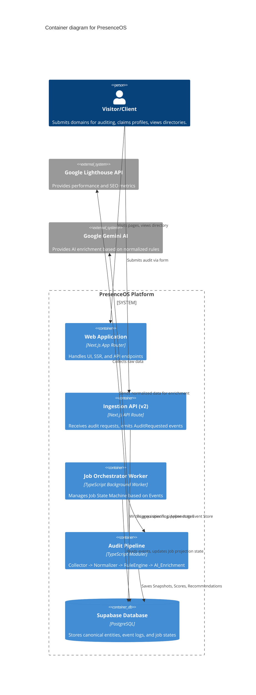

# C4 Container Diagram: PresenceOS

```mermaid
C4Container
    title Container diagram for PresenceOS

    Person(visitor, "Visitor/Client", "Submits domains for auditing, claims profiles, views directories.")
    
    System_Boundary(c1, "PresenceOS Platform") {
        Container(webapp, "Web Application", "Next.js App Router", "Handles UI, SSR, and API endpoints")
        Container(ingestion_api, "Ingestion API (v2)", "Next.js API Route", "Receives audit requests, emits AuditRequested events")
        Container(orchestrator, "Job Orchestrator Worker", "TypeScript Background Worker", "Manages Job State Machine based on Events")
        Container(audit_pipeline, "Audit Pipeline", "TypeScript Moduler", "Collector -> Normalizer -> RuleEngine -> AI_Enrichment")
        ContainerDb(supabase_db, "Supabase Database", "PostgreSQL", "Stores canonical entities, event logs, and job states")
    }

    System_Ext(lighthouse, "Google Lighthouse API", "Provides performance and SEO metrics")
    System_Ext(gemini, "Google Gemini AI", "Provides AI enrichment based on normalized rules")

    Rel(visitor, webapp, "Visits pages, views directory")
    Rel(visitor, ingestion_api, "Submits audit via form")
    
    Rel(ingestion_api, supabase_db, "Writes acquisition log, Appends to Event Store")
    Rel(orchestrator, supabase_db, "Reads events, updates Job projection state")
    Rel(orchestrator, audit_pipeline, "Triggers specific pipeline stages")
    
    Rel(audit_pipeline, lighthouse, "Collects raw data")
    Rel(audit_pipeline, gemini, "Sends normalized data for enrichment")
    Rel(audit_pipeline, supabase_db, "Saves Snapshots, Scores, Recommendations")
```
